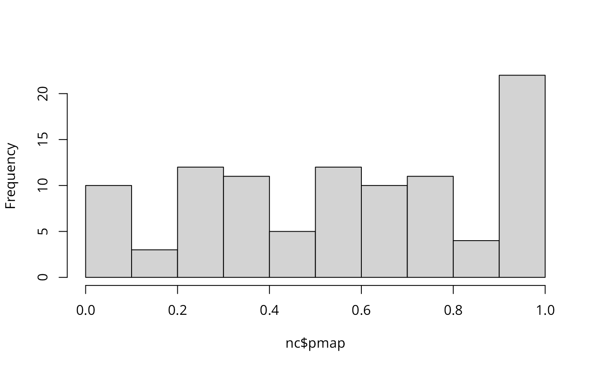
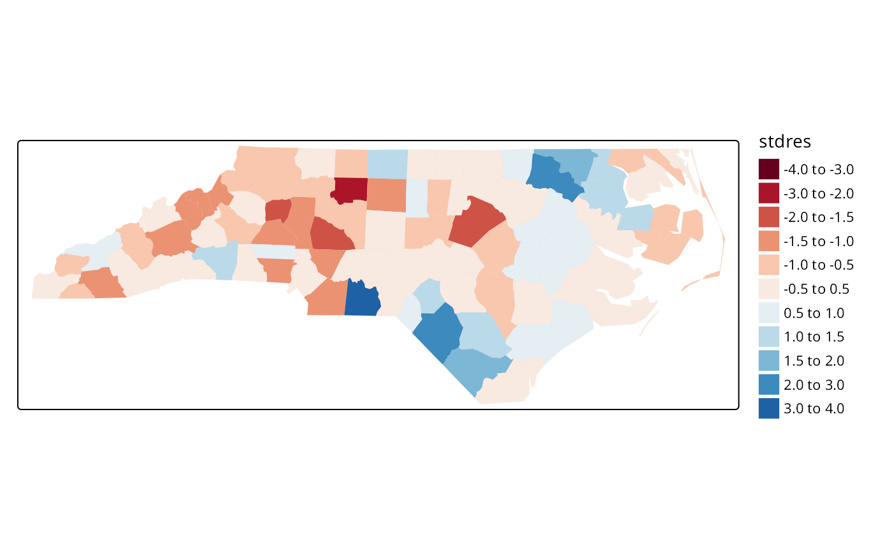
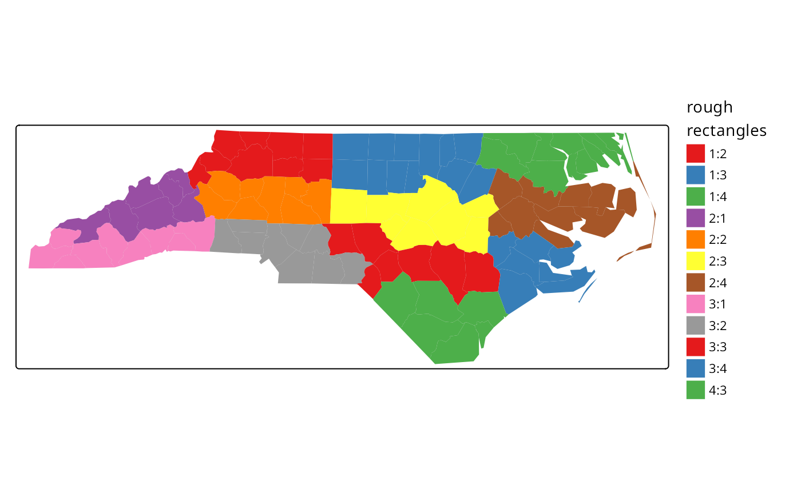

# Introduction to the North Carolina SIDS data set (re-revised)

## Introduction

This data set was presented first in Symons, Grimson, and Yuan (1983),
analysed with reference to the spatial nature of the data in Cressie and
Read (1985), expanded in Cressie and Chan (1989), and used in detail in
Cressie (1991). It is for the 100 counties of North Carolina, and
includes counts of numbers of live births (also non-white live births)
and numbers of sudden infant deaths, for the July 1, 1974 to June 30,
1978 and July 1, 1979 to June 30, 1984 periods. In Cressie and Read
(1985), a listing of county neighbours based on shared boundaries
(contiguity) is given, and in Cressie and Chan (1989), and in Cressie
(1991, 386–89), a different listing based on the criterion of distance
between county seats, with a cutoff at 30 miles. The county seat
location coordinates are given in miles in a local (unknown) coordinate
reference system. The data are also used to exemplify a range of
functions in the spatial statistics module user’s manual (Kaluzny et al.
1996).

## Getting the data into R

We will be using the **spdep** and **spreg** packages, here version:
spdep, version 1.4-2, 2026-01-12, the **sf** package and the **tmap**
package. The data from the sources referred to above is documented in
the help page for the `nc.sids` data set in **spData**. The actual data,
included in a shapefile of the county boundaries for North Carolina were
made available in the **maptools** package [^1]. These data are known to
be geographical coordinates (longitude-latitude in decimal degrees) and
are assumed to use the NAD27 datum. The ESRI Shapefile is deprecated,
and was replaced here by a GeoPackage, written from reading the original
files in **spData** 2.3.1:

``` r
library(spdep)
nc <- st_read(system.file("shapes/sids.gpkg", package="spData")[1], quiet=TRUE)
#st_crs(nc) <- "EPSG:4267"
row.names(nc) <- as.character(nc$FIPSNO)
```

The shapefile format presupposed that you had three files with
extensions `.shp`, `.shx`, and `.dbf`, where the first contains the
geometry data, the second the spatial index, and the third the attribute
data. They were required to have the same name apart from the extension,
and were read here using
[`sf::st_read()`](https://r-spatial.github.io/sf/reference/st_read.html)
into the `sf` object `nc`; the class is defined in **sf**. The centroids
of the largest polygon in each county are available using the
`st_centroid` method from **sf** as an **sfc** POINT object, and can be
used to place labels after the extraction of the coordinate matrix:

``` r
sf_use_s2(TRUE)
plot(st_geometry(nc), axes=TRUE)
text(st_coordinates(st_centroid(st_geometry(nc), of_largest_polygon=TRUE)), label=nc$FIPSNO, cex=0.5)
```

We can examine the names of the columns of the data frame to see what it
contains — in fact some of the same columns that we will be examining
below, and some others which will be useful in cleaning the data set.

``` r
names(nc)
```

    ##  [1] "CNTY_ID"   "AREA"      "PERIMETER" "CNTY_"     "NAME"      "FIPS"     
    ##  [7] "FIPSNO"    "CRESS_ID"  "BIR74"     "SID74"     "NWBIR74"   "BIR79"    
    ## [13] "SID79"     "NWBIR79"   "east"      "north"     "x"         "y"        
    ## [19] "lon"       "lat"       "L_id"      "M_id"      "geom"

``` r
summary(nc)
```

    ##     CNTY_ID          AREA          PERIMETER         CNTY_     
    ##  Min.   :1825   Min.   :0.0420   Min.   :0.999   Min.   :1825  
    ##  1st Qu.:1902   1st Qu.:0.0910   1st Qu.:1.324   1st Qu.:1902  
    ##  Median :1982   Median :0.1205   Median :1.609   Median :1982  
    ##  Mean   :1986   Mean   :0.1263   Mean   :1.673   Mean   :1986  
    ##  3rd Qu.:2067   3rd Qu.:0.1542   3rd Qu.:1.859   3rd Qu.:2067  
    ##  Max.   :2241   Max.   :0.2410   Max.   :3.640   Max.   :2241  
    ##      NAME               FIPS               FIPSNO         CRESS_ID     
    ##  Length:100         Length:100         Min.   :37001   Min.   :  1.00  
    ##  Class :character   Class :character   1st Qu.:37050   1st Qu.: 25.75  
    ##  Mode  :character   Mode  :character   Median :37100   Median : 50.50  
    ##                                        Mean   :37100   Mean   : 50.50  
    ##                                        3rd Qu.:37150   3rd Qu.: 75.25  
    ##                                        Max.   :37199   Max.   :100.00  
    ##      BIR74           SID74          NWBIR74           BIR79      
    ##  Min.   :  248   Min.   : 0.00   Min.   :   1.0   Min.   :  319  
    ##  1st Qu.: 1077   1st Qu.: 2.00   1st Qu.: 190.0   1st Qu.: 1336  
    ##  Median : 2180   Median : 4.00   Median : 697.5   Median : 2636  
    ##  Mean   : 3300   Mean   : 6.67   Mean   :1051.0   Mean   : 4224  
    ##  3rd Qu.: 3936   3rd Qu.: 8.25   3rd Qu.:1168.5   3rd Qu.: 4889  
    ##  Max.   :21588   Max.   :44.00   Max.   :8027.0   Max.   :30757  
    ##      SID79          NWBIR79             east           north      
    ##  Min.   : 0.00   Min.   :    3.0   Min.   : 19.0   Min.   :  6.0  
    ##  1st Qu.: 2.00   1st Qu.:  250.5   1st Qu.:178.8   1st Qu.: 97.0  
    ##  Median : 5.00   Median :  874.5   Median :285.0   Median :125.5  
    ##  Mean   : 8.36   Mean   : 1352.8   Mean   :271.3   Mean   :122.1  
    ##  3rd Qu.:10.25   3rd Qu.: 1406.8   3rd Qu.:361.2   3rd Qu.:151.5  
    ##  Max.   :57.00   Max.   :11631.0   Max.   :482.0   Max.   :182.0  
    ##        x                 y             lon              lat       
    ##  Min.   :-328.04   Min.   :3757   Min.   :-84.08   Min.   :33.92  
    ##  1st Qu.: -60.55   1st Qu.:3920   1st Qu.:-81.20   1st Qu.:35.26  
    ##  Median : 114.38   Median :3963   Median :-79.26   Median :35.68  
    ##  Mean   :  91.46   Mean   :3953   Mean   :-79.51   Mean   :35.62  
    ##  3rd Qu.: 240.03   3rd Qu.:4000   3rd Qu.:-77.87   3rd Qu.:36.05  
    ##  Max.   : 439.65   Max.   :4060   Max.   :-75.67   Max.   :36.52  
    ##       L_id           M_id                 geom    
    ##  Min.   :1.00   Min.   :1.00   MULTIPOLYGON :100  
    ##  1st Qu.:1.00   1st Qu.:2.00   epsg:4267    :  0  
    ##  Median :2.00   Median :3.00   +proj=long...:  0  
    ##  Mean   :2.12   Mean   :2.67                      
    ##  3rd Qu.:3.00   3rd Qu.:3.25                      
    ##  Max.   :4.00   Max.   :4.00

Let’s check the different versions of the data against each other -
**sf** and **spData** have NC SIDS files, as does GeoDa Center in two
forms:

``` r
library(sf)
nc_sf <- st_read(system.file("shape/nc.shp", package="sf"),
                 quiet=TRUE)
st_crs(nc_sf)
```

    ## Coordinate Reference System:
    ##   User input: NAD27 
    ##   wkt:
    ## GEOGCRS["NAD27",
    ##     DATUM["North American Datum 1927",
    ##         ELLIPSOID["Clarke 1866",6378206.4,294.978698213898,
    ##             LENGTHUNIT["metre",1]]],
    ##     PRIMEM["Greenwich",0,
    ##         ANGLEUNIT["degree",0.0174532925199433]],
    ##     CS[ellipsoidal,2],
    ##         AXIS["latitude",north,
    ##             ORDER[1],
    ##             ANGLEUNIT["degree",0.0174532925199433]],
    ##         AXIS["longitude",east,
    ##             ORDER[2],
    ##             ANGLEUNIT["degree",0.0174532925199433]],
    ##     ID["EPSG",4267]]

``` r
nc <- st_read(system.file("shapes/sids.gpkg",
                 package="spData"), quiet=TRUE)
st_crs(nc)
```

    ## Coordinate Reference System:
    ##   User input: NAD27 
    ##   wkt:
    ## GEOGCRS["NAD27",
    ##     DATUM["North American Datum 1927",
    ##         ELLIPSOID["Clarke 1866",6378206.4,294.978698213898,
    ##             LENGTHUNIT["metre",1]]],
    ##     PRIMEM["Greenwich",0,
    ##         ANGLEUNIT["degree",0.0174532925199433]],
    ##     CS[ellipsoidal,2],
    ##         AXIS["geodetic latitude (Lat)",north,
    ##             ORDER[1],
    ##             ANGLEUNIT["degree",0.0174532925199433]],
    ##         AXIS["geodetic longitude (Lon)",east,
    ##             ORDER[2],
    ##             ANGLEUNIT["degree",0.0174532925199433]],
    ##     USAGE[
    ##         SCOPE["Geodesy."],
    ##         AREA["North and central America: Antigua and Barbuda - onshore. Bahamas - onshore plus offshore over internal continental shelf only. Belize - onshore. British Virgin Islands - onshore. Canada onshore - Alberta, British Columbia, Manitoba, New Brunswick, Newfoundland and Labrador, Northwest Territories, Nova Scotia, Nunavut, Ontario, Prince Edward Island, Quebec, Saskatchewan and Yukon - plus offshore east coast. Cuba - onshore and offshore. El Salvador - onshore. Guatemala - onshore. Honduras - onshore. Panama - onshore. Puerto Rico - onshore. Mexico - onshore plus offshore east coast. Nicaragua - onshore. United States (USA) onshore and offshore - Alabama, Alaska, Arizona, Arkansas, California, Colorado, Connecticut, Delaware, Florida, Georgia, Idaho, Illinois, Indiana, Iowa, Kansas, Kentucky, Louisiana, Maine, Maryland, Massachusetts, Michigan, Minnesota, Mississippi, Missouri, Montana, Nebraska, Nevada, New Hampshire, New Jersey, New Mexico, New York, North Carolina, North Dakota, Ohio, Oklahoma, Oregon, Pennsylvania, Rhode Island, South Carolina, South Dakota, Tennessee, Texas, Utah, Vermont, Virginia, Washington, West Virginia, Wisconsin and Wyoming - plus offshore . US Virgin Islands - onshore."],
    ##         BBOX[7.15,167.65,83.17,-47.74]],
    ##     ID["EPSG",4267]]

As the actual CRS was unknown, the GeoPackage **spData** version has
been updated to `"EPSG:4267"`.

Next, are the geometries the same?
[`sf::st_equals`](https://r-spatial.github.io/sf/reference/geos_binary_pred.html)
returns a logical matrix, so we’ll check that the diagonal values are
all `TRUE`, and that only those values are `TRUE` by summing and
recalling that `n` is `100`:

``` r
suppressWarnings(st_crs(nc_sf) <- st_crs(nc))
xx <- st_equals(nc, nc_sf, sparse=FALSE)
all(diag(xx)) && sum(xx) == 100L
```

    ## [1] TRUE

Next, let’s download the GeoDa files and repeat the comparisons:

``` r
td <- tempdir()
#download.file("https://geodacenter.github.io/data-and-lab//data/sids.zip", file.path(td, "sids.zip"), quiet=TRUE) 
# local copy (2020-10-22) as repository sometimes offline
file.copy(system.file("etc/misc/sids.zip", package="spdep"), td)
```

    ## [1] TRUE

``` r
unzip(file.path(td, "sids.zip"), c("sids/sids.dbf", "sids/sids.prj", "sids/sids.shp", "sids/sids.shx"), exdir=td)
sids_sf <- st_read(file.path(td, "sids/sids.shp"), quiet=TRUE)
#download.file("https://geodacenter.github.io/data-and-lab//data/sids2.zip", file.path(td, "sids2.zip"), quiet=TRUE)
file.copy(system.file("etc/misc/sids2.zip", package="spdep"), td)
```

    ## [1] TRUE

``` r
unzip(file.path(td, "sids2.zip"), c("sids2/sids2.dbf", "sids2/sids2.prj", "sids2/sids2.shp", "sids2/sids2.shx"), exdir=td)
sids2_sf <- st_read(file.path(td, "sids2/sids2.shp"), quiet=TRUE)
```

``` r
st_crs(sids_sf)
```

    ## Coordinate Reference System:
    ##   User input: WGS 84 
    ##   wkt:
    ## GEOGCRS["WGS 84",
    ##     DATUM["World Geodetic System 1984",
    ##         ELLIPSOID["WGS 84",6378137,298.257223563,
    ##             LENGTHUNIT["metre",1]]],
    ##     PRIMEM["Greenwich",0,
    ##         ANGLEUNIT["degree",0.0174532925199433]],
    ##     CS[ellipsoidal,2],
    ##         AXIS["latitude",north,
    ##             ORDER[1],
    ##             ANGLEUNIT["degree",0.0174532925199433]],
    ##         AXIS["longitude",east,
    ##             ORDER[2],
    ##             ANGLEUNIT["degree",0.0174532925199433]],
    ##     ID["EPSG",4326]]

``` r
st_crs(sids2_sf)
```

    ## Coordinate Reference System:
    ##   User input: WGS 84 
    ##   wkt:
    ## GEOGCRS["WGS 84",
    ##     DATUM["World Geodetic System 1984",
    ##         ELLIPSOID["WGS 84",6378137,298.257223563,
    ##             LENGTHUNIT["metre",1]]],
    ##     PRIMEM["Greenwich",0,
    ##         ANGLEUNIT["degree",0.0174532925199433]],
    ##     CS[ellipsoidal,2],
    ##         AXIS["latitude",north,
    ##             ORDER[1],
    ##             ANGLEUNIT["degree",0.0174532925199433]],
    ##         AXIS["longitude",east,
    ##             ORDER[2],
    ##             ANGLEUNIT["degree",0.0174532925199433]],
    ##     ID["EPSG",4326]]

It looks as though the external files are assuming WGS84/NAD83 for the
datum, but also contain the same geometries.

``` r
suppressWarnings(st_crs(sids_sf) <- st_crs(nc_sf))
xx <- st_equals(sids_sf, nc_sf, sparse=FALSE)
all(diag(xx)) && sum(xx) == 100L
```

    ## [1] FALSE

``` r
suppressWarnings(st_crs(sids2_sf) <- st_crs(nc_sf))
xx <- st_equals(sids2_sf, nc_sf, sparse=FALSE)
all(diag(xx)) && sum(xx) == 100L
```

    ## [1] FALSE

Now for the contents of the files - `sids2` also contains rates, while
the file in `spData` contains the coordinates as given in Cressie
(1991), and the parcels of contiguous counties on p. 554, and the
aggregations used for median polishing.

``` r
all.equal(as.data.frame(nc_sf)[,1:14], as.data.frame(sids_sf)[,1:14])
```

    ##  [1] "Names: 12 string mismatches"                                  
    ##  [2] "Component 4: Modes: numeric, character"                       
    ##  [3] "Component 4: target is numeric, current is character"         
    ##  [4] "Component 5: 100 string mismatches"                           
    ##  [5] "Component 6: Modes: character, numeric"                       
    ##  [6] "Component 6: target is character, current is numeric"         
    ##  [7] "Component 7: Mean relative difference: 0.9986388"             
    ##  [8] "Component 8: Mean relative difference: 64.33901"              
    ##  [9] "Component 9: Mean relative difference: 0.9979786"             
    ## [10] "Component 10: Mean relative difference: 156.5427"             
    ## [11] "Component 11: Mean relative difference: 3.01968"              
    ## [12] "Component 12: Mean relative difference: 0.9980208"            
    ## [13] "Component 13: Mean relative difference: 160.8194"             
    ## [14] "Component 14: Modes: numeric, list"                           
    ## [15] "Component 14: Attributes: < target is NULL, current is list >"
    ## [16] "Component 14: target is numeric, current is sfc_MULTIPOLYGON"

``` r
all.equal(as.data.frame(nc_sf)[,1:14], as.data.frame(sids2_sf)[,1:14])
```

    ##  [1] "Names: 12 string mismatches"                         
    ##  [2] "Component 4: Modes: numeric, character"              
    ##  [3] "Component 4: target is numeric, current is character"
    ##  [4] "Component 5: 100 string mismatches"                  
    ##  [5] "Component 6: Modes: character, numeric"              
    ##  [6] "Component 6: target is character, current is numeric"
    ##  [7] "Component 7: Mean relative difference: 0.9986388"    
    ##  [8] "Component 8: Mean relative difference: 64.33901"     
    ##  [9] "Component 9: Mean relative difference: 0.9979786"    
    ## [10] "Component 10: Mean relative difference: 156.5427"    
    ## [11] "Component 11: Mean relative difference: 3.01968"     
    ## [12] "Component 12: Mean relative difference: 0.9980208"   
    ## [13] "Component 13: Mean relative difference: 160.8194"    
    ## [14] "Component 14: Mean relative difference: 0.9984879"

The **spData** data set has some columns reordered and a surprise:

``` r
all.equal(as.data.frame(nc_sf)[,1:14], as.data.frame(nc)[,c(2,3,4,1,5:14)])
```

    ## [1] "Component \"NWBIR74\": Mean relative difference: 0.04891304"

so a difference in `NWBIR74`:

``` r
which(!(nc_sf$NWBIR74 == nc$NWBIR74))
```

    ## [1] 21

``` r
c(nc$NWBIR74[21], nc_sf$NWBIR74[21])
```

    ## [1] 386 368

where **spData** follows Cressie (1991) and **sf** and Geoda follow
Cressie and Chan (1989) for NWBIR74 in Chowan county.

We will now examine the data set reproduced from Cressie and
collaborators, included in **spData** (formerly in **spdep**), and add
the neighbour relationships used in Cressie and Chan (1989) to the
background map as a graph shown in Figure \\\ref{plot-CC89.nb}\\:

``` r
gal_file <- system.file("weights/ncCR85.gal", package="spData")[1]
ncCR85 <- read.gal(gal_file, region.id=nc$FIPSNO)
ncCR85
```

    ## Neighbour list object:
    ## Number of regions: 100 
    ## Number of nonzero links: 492 
    ## Percentage nonzero weights: 4.92 
    ## Average number of links: 4.92

``` r
gal_file <- system.file("weights/ncCC89.gal", package="spData")[1]
ncCC89 <- read.gal(gal_file, region.id=nc$FIPSNO)
ncCC89
```

    ## Neighbour list object:
    ## Number of regions: 100 
    ## Number of nonzero links: 394 
    ## Percentage nonzero weights: 3.94 
    ## Average number of links: 3.94 
    ## 2 regions with no links:
    ## 37055, 37095
    ## 3 disjoint connected subgraphs

``` r
plot(st_geometry(nc), border="grey")
plot(ncCC89, st_centroid(st_geometry(nc), of_largest_polygon), add=TRUE, col="blue")
```

Printing the neighbour object shows that it is a neighbour list object,
with a very sparse structure — if displayed as a matrix, only 3.94% of
cells would be filled. Objects of class `nb` contain a list as long as
the number of counties; each component of the list is a vector with the
index numbers of the neighbours of the county in question, so that the
neighbours of the county with `region.id` of `37001` can be retreived by
matching against the indices. More information can be obtained by using
[`summary()`](https://rspatial.github.io/terra/reference/summary.html)
on an `nb` object. Finally, we associate a vector of names with the
neighbour list, through the `row.names` argument. The names should be
unique, as with data frame row names.

``` r
r.id <- attr(ncCC89, "region.id")
ncCC89[[match("37001", r.id)]]
```

    ## [1] 11 26 29 30 48

``` r
r.id[ncCC89[[match("37001", r.id)]]]
```

    ## [1] 37033 37081 37135 37063 37037

The neighbour list object records neighbours by their order in relation
to the list itself, so the neighbours list for the county with
`region.id` “37001” are the seventeenth, nineteenth, thirty-second,
forty-first and sixty-eighth in the list. We can retreive their codes by
looking them up in the `region.id` attribute.

``` r
as.character(nc$NAME)[card(ncCC89) == 0]
```

    ## [1] "Dare" "Hyde"

We should also note that this neighbour criterion generates two counties
with no neighbours, Dare and Hyde, whose county seats were more than 30
miles from their nearest neighbours. The
[`card()`](https://r-spatial.github.io/spdep/reference/card.md) function
returns the cardinality of the neighbour set. We need to return to
methods for handling no-neighbour objects later on. We will also show
how new neighbours lists may be constructed in , and compare these with
those from the literature.

### Probability mapping

Rather than review functions for measuring and modelling spatial
dependence in the **spdep** package, we will focus on probability
mapping for disease rates data. Typically, we have counts of the
incidence of some disease by spatial unit, associated with counts of
populations at risk. The task is then to try to establish whether any
spatial units seem to be characterised by higher or lower counts of
cases than might have been expected in general terms (Bailey and Gatrell
1995).

An early approach by Choynowski (1959), described by Cressie and Read
(1985) and Bailey and Gatrell (1995), assumes, given that the true rate
for the spatial units is small, that as the population at risk increases
to infinity, the spatial unit case counts are Poisson with mean value
equal to the population at risk times the rate for the study area as a
whole. Choynowski’s approach folds the two tails of the measured
probabilities together, so that small values, for a chosen \\\alpha\\,
occur for spatial units with either unusually high or low rates. For
this reason, the high and low counties are plotted separately below.
Note that `cut` returns a `factor` labeled with cut intervals.

``` r
ch <- choynowski(nc$SID74, nc$BIR74)
nc$ch_pmap_low <- ifelse(ch$type, ch$pmap, NA)
nc$ch_pmap_high <- ifelse(!ch$type, ch$pmap, NA)
prbs <- c(0,.001,.01,.05,.1,1)
nc$high = cut(nc$ch_pmap_high, prbs)
nc$low = cut(nc$ch_pmap_low,prbs )
```

``` r
is_tmap <- FALSE
if (require(tmap, quietly=TRUE)) is_tmap <- TRUE
is_tmap
```

    ## [1] TRUE

``` r
library(tmap)
tmap4 <- packageVersion("tmap") >= "3.99"
if (tmap4) {
  tm_shape(nc) + tm_polygons(fill=c("low", "high"), fill.scale = tm_scale(values="brewer.set1"), fill.legend = tm_legend("p-values", frame=FALSE, item.r = 0), fill.free=FALSE, lwd=0.01) + tm_layout(panel.labels=c("low", "high"))
} else {
tm_shape(nc) + tm_fill(c("low", "high"), palette="Set1", title="p-values") +
  tm_facets(free.scales=FALSE) + tm_layout(panel.labels=c("low", "high"))
}
```


For more complicated thematic maps, it may be helpful to use ColorBrewer
(<https://colorbrewer2.org>) colour palettes. Here we use palettes
accessed through **tmap**, available in R in the **RColorBrewer**
package.

While the
[`choynowski()`](https://r-spatial.github.io/spdep/reference/choynowski.md)
function only provides the probability map values required, the
[`probmap()`](https://r-spatial.github.io/spdep/reference/probmap.md)
function returns raw (crude) rates, expected counts (assuming a constant
rate across the study area), relative risks, and Poisson probability map
values calculated using the standard cumulative distribution function
[`ppois()`](https://rdrr.io/r/stats/Poisson.html). This does not fold
the tails together, so that counties with lower observed counts than
expected, based on population size, have values in the lower tail, and
those with higher observed counts than expected have values in the upper
tail, as we can see.

``` r
pmap <- probmap(nc$SID74, nc$BIR74)
nc$pmap <- pmap$pmap
```

``` r
brks <- c(0,0.001,0.01,0.025,0.05,0.95,0.975,0.99,0.999,1)
if (tmap4) {
  tm_shape(nc) + tm_polygons(fill="pmap", fill.scale = tm_scale(values="brewer.rd_bu", midpoint=0.5, breaks=brks), fill.legend = tm_legend(frame=FALSE, item.r = 0, position = tm_pos_out("right", "center")), lwd=0.01) + tm_layout(component.autoscale=FALSE)
} else {
tm_shape(nc) + tm_fill("pmap", breaks=brks, midpoint=0.5, palette="RdBu") + tm_layout(legend.outside=TRUE)
}
```


Marilia Carvalho (personal communication) and Virgilio Gómez Rubio
(Gómez-Rubio, Ferrándiz-Ferragud, and López-Quílez 2005) have pointed to
the unusual shape of the distribution of the Poisson probability values
(histogram below), repeating the doubts about probability mapping voiced
by Cressie (1991, 392): “an extreme value \\\ldots\\ may be more due to
its lack of fit to the Poisson model than to its deviation from the
constant rate assumption”. There are many more high values than one
would have expected, suggesting perhaps overdispersion, that is that the
ratio of the variance and mean is larger than unity.

``` r
hist(nc$pmap, main="")
```



One ad-hoc way to assess the impact of the possible failure of our
assumption that the counts follow the Poisson distribution is to
estimate the dispersion by fitting a generalized linear model of the
observed counts including only the intercept (null model) and offset by
the observed population at risk (suggested by Marilia Carvalho and
associates):

``` r
res <- glm(SID74 ~ offset(log(BIR74)), data=nc, family="quasipoisson")
nc$stdres <- rstandard(res)
```

``` r
brks <- c(-4, -3, -2, -1.5, -1, -0.5, 0.5, 1, 1.5, 2, 3, 4)
if (tmap4) {
  tm_shape(nc) + tm_polygons(fill="stdres", fill.scale = tm_scale(values="brewer.rd_bu", midpoint=0.5, breaks=brks), fill.legend = tm_legend(frame=FALSE, item.r = 0, position = tm_pos_out("right", "center")), lwd=0.01) + tm_layout(component.autoscale=FALSE)
} else {
  tm_shape(nc) + tm_fill("stdres", breaks=brks, midpoint=0, palette="RdBu") + tm_layout(legend.outside=TRUE)
}
```



The dispersion is equal to 2.2786188, much greater than unity; we
calculate the corrected probability map values by taking the
standardised residuals of the model, taking the size of the dispersion
into account; the results are shown above. Many fewer counties appear
now to have unexpectedly large or small numbers of cases. This is an
ad-hoc adjustment made because R provides access to a wide range of
model-fitting functions that can be used to help check our assumptions.
Gómez-Rubio, Ferrándiz-Ferragud, and López-Quílez (2005) chose rather to
construct a probability map under the hypothesis that data are drawn
from a Negative Binomial distribution.

So far, none of the maps presented have made use of the spatial
dependence possibly present in the data. A further elementary step that
can be taken is to map Empirical Bayes estimates of the rates, which are
smoothed in relation to the raw rates. The underlying question here is
linked to the larger variance associated with rate estimates for
counties with small populations at risk compared with counties with
large populations at risk. Empirical Bayes estimates place more credence
on the raw rates of counties with large populations at risk, and modify
them much less than they modify rates for small counties. In the case of
small populations at risk, more confidence is placed in either the
global rate for the study area as a whole, or for local Empirical Bayes
estimates, in rates for a larger moving window including the neighbours
of the county being estimated. The function used for this in **spdep**
is
[`EBlocal()`](https://r-spatial.github.io/spdep/reference/EBlocal.md),
initially contributed by Marilia Carvalho. It parallels a similar
function in GeoDa, but uses the Bailey and Gatrell (1995) interpretation
of Marshall (1991), rather than that in GeoDa (Anselin, Syabri, and
Smirnov 2002).

``` r
global_rate <- sum(nc$SID74)/sum(nc$BIR74)
nc$Expected <- global_rate * nc$BIR74
res <- EBlocal(nc$SID74, nc$Expected, ncCC89, zero.policy=TRUE)
nc$EB_loc <- res$est
```

``` r
brks <- c(0, 0.25, 0.5, 0.75, 1, 2, 3, 4, 5)
nc_miss <- st_centroid(st_geometry(nc[card(ncCC89) == 0,]), of_largest_polygon)
if (tmap4) {
  tm_shape(nc) + tm_polygons(fill="stdres", fill.scale = tm_scale(values="brewer.rd_bu", midpoint=0.5, breaks=brks), fill.legend = tm_legend(frame=FALSE, item.r = 0, position = tm_pos_out("right", "center")), lwd=0.01) + tm_layout(component.autoscale=FALSE) + tm_shape(nc_miss) + tm_symbols(shape=8, size=0.5)
} else {
tm_shape(nc) + tm_fill("EB_loc", breaks=brks, midpoint=1, palette="RdBu") + tm_layout(legend.outside=TRUE) + tm_shape(nc_miss) + tm_symbols(shape=8, size=0.5)
}
```


The results are shown in Figure \\\ref{EBlocal}\\. Like other relevant
functions in
**spdep**,[`EBlocal()`](https://r-spatial.github.io/spdep/reference/EBlocal.md)
takes a `zero.policy` argument to allow missing values to be passed
through. In this case, no local estimate is available for the two
counties with no neighbours, marked by stars.

In addition to Empirical Bayes smoothing globally, used both for disease
mapping and the Assuncão and Reis correction to Moran’s \\I\\ for rates
data (to shrink towards the global rate when the population at risk is
small, here as a Monte Carlo test), lists of local neighbours can be
used to shrink towards a local rate.

``` r
set.seed(1)
EBImoran.mc(nc$SID74, nc$BIR74, nb2listw(ncCC89, style="B", zero.policy=TRUE), nsim=999, zero.policy=TRUE)
```

    ## 
    ##  Monte-Carlo simulation of Empirical Bayes Index (mean subtracted)
    ## 
    ## data:  cases: nc$SID74, risk population: nc$BIR74
    ## weights: nb2listw(ncCC89, style = "B", zero.policy = TRUE)
    ## number of simulations + 1: 1000
    ## 
    ## statistic = 0.25789, observed rank = 998, p-value = 0.002
    ## alternative hypothesis: greater

## Exploration and modelling of the data

One of the first steps taken by Cressie and Read (1985) is to try to
bring out spatial trends by dividing North Carolina up into \\4\times4\\
rough rectangles. Just to see how this works, let us map these rough
rectangles before proceeding further.

``` r
nc$both <- factor(paste(nc$L_id, nc$M_id, sep=":"))
nboth <- length(table(unclass(nc$both)))
```

``` r
if (tmap4) {
  tm_shape(nc) + tm_polygons(fill="both", fill.scale=tm_scale(values="brewer.set1"), fill.legend = tm_legend("rough\nrectangles", frame=FALSE, item.r = 0, position = tm_pos_out("right", "center")), lwd=0.01) + tm_layout(component.autoscale=FALSE)
} else {
tm_shape(nc) + tm_fill("both", palette="Set1", title="rough\nrectangles") + tm_layout(legend.outside=TRUE)
}
```



Cressie constructs a transformed SIDS rates variable, 1974–78, for his
analyses (with co-workers). We can replicate his stem-and-leaf figure on
p. 396 in the book, taken from Cressie and Read (1989):

``` r
nc$ft.SID74 <- sqrt(1000)*(sqrt(nc$SID74/nc$BIR74) + sqrt((nc$SID74+1)/nc$BIR74))
stem(round(nc$ft.SID74, 1), scale=2)
```

    ## 
    ##   The decimal point is at the |
    ## 
    ##   0 | 9
    ##   1 | 111244
    ##   1 | 567789999
    ##   2 | 0011111222334444
    ##   2 | 55555666677778999999999
    ##   3 | 000111122333333344444444
    ##   3 | 5568999
    ##   4 | 013344
    ##   4 | 555557
    ##   5 | 2
    ##   5 | 
    ##   6 | 3

### Median polish smoothing

Cressie (1991, 46–48, 393–400) discusses in some detail how smoothing
may be used to partition the variation in the data into smooth and
rough. In order to try it out on the North Carolina SIDS data set, we
will use a coarse gridding into four columns and four rows given by
Cressie (1991, 553–54), where four grid cells are empty; these are given
by variables `L_id` and `M_id` in object `nc`. Next we aggregate the
number of live births and the number of SIDS cases 1974–1978 for the
grid cells:

``` r
mBIR74 <- tapply(nc$BIR74, nc$both, sum)
mSID74 <- tapply(nc$SID74, nc$both, sum)
```

Using the same Freeman-Tukey transformation as is used for the county
data, we coerce the data into a correctly configured matrix, some of the
cells of which are empty. The `medpolish` function is applied to the
matrix, being told to remove empty cells; the function iterates over the
rows and columns of the matrix using `median` to extract an overall
effect, row and column effects, and residuals:

``` r
mFT <- sqrt(1000)*(sqrt(mSID74/mBIR74) + sqrt((mSID74+1)/mBIR74))
# mFT1 <- t(matrix(mFT, 4, 4, byrow=TRUE))
# wrong assignment of 12 elements to a 4x4 matrix detected by CRAN test 2021-05-22
rc <- do.call("rbind", lapply(strsplit(names(mFT), ":"), as.integer))
mFT1 <- matrix(as.numeric(NA), 4, 4)
for (i in 1:nrow(rc)) mFT1[rc[i,1], rc[i,2]] <- mFT[i]
med <- medpolish(mFT1, na.rm=TRUE, trace.iter=FALSE)
med
```

    ## 
    ## Median Polish Results (Dataset: "mFT1")
    ## 
    ## Overall: 2.90965
    ## 
    ## Row Effects:
    ## [1] -0.05686791 -0.37236370  0.05686791  0.79541774
    ## 
    ## Column Effects:
    ## [1] -0.005484562 -0.446250551  0.003656375  0.726443256
    ## 
    ## Residuals:
    ##           [,1]     [,2]      [,3]     [,4]
    ## [1,]        NA -0.45800  0.000000  0.37556
    ## [2,] -0.092554  0.00000  0.101695  0.00000
    ## [3,]  0.092554  0.30464 -0.090726 -0.55364
    ## [4,]        NA       NA  0.000000       NA

Returning to the factors linking rows and columns to counties, and
generating matrices of dummy variables using `model.matrix`, we can
calculate fitted values of the Freeman-Tukey adjusted rate for each
county, and residuals by subtracting the fitted value from the observed
rate. Naturally, the fitted value will be the same for counties in the
same grid cell:

``` r
mL_id <- model.matrix(~ as.factor(nc$L_id) -1)
mM_id <- model.matrix(~ as.factor(nc$M_id) -1)
nc$pred <- c(med$overall + mL_id %*% med$row + mM_id %*% med$col)
nc$mp_resid <- nc$ft.SID74 - nc$pred
```

``` r
if (tmap4) {
  out1 <- tm_shape(nc) + tm_polygons(fill=c("ft.SID74", "pred"), fill.scale=tm_scale(values="brewer.yl_or_br"), fill.legend=tm_legend(position=tm_pos_out("right", "center"), frame=FALSE, item.r = 0), fill.free=FALSE, lwd=0.01) + tm_layout(panel.labels=c("Observed", "Median polish prediction"))
  out2 <- tm_shape(nc) + tm_polygons(fill="mp_resid", fill.scale=tm_scale(values="brewer.rd_yl_gn", midpoint=0), fill.legend=tm_legend(position=tm_pos_out("right", "center"), frame=FALSE, item.r = 0), lwd=0.01)
} else {
out1 <- tm_shape(nc) + tm_fill(c("ft.SID74", "pred")) + tm_facets(free.scales=FALSE) + tm_layout(panel.labels=c("Observed", "Median polish prediction"))
out2 <- tm_shape(nc) + tm_fill("mp_resid", midpoint=0) + tm_layout(legend.outside=TRUE)
}
tmap_arrange(out1, out2, ncol=1)
```


The figure shows the median polish smoothing results as three maps, the
observed Freeman-Tukey transformed SIDS rates, the fitted smoothed
values, and the residuals. In addition, a plot for the median polish
object is also shown, plotting the smooth residuals against the outer
product of the row and column effects divided by the overall effect,
which would indicate a lack of additivity between row and column if this
was the case — this is more relevant for analysis of tables of
covariates rather than geographical grids.

## References

Anselin, Luc, Ibnu Syabri, and Oleg Smirnov. 2002. “Visualizing
Multivariate Spatial Correlation with Dynamically Linked Windows.” In
*University of California, Santa Barbara. CD-ROM*.

Bailey, T. C., and A. C. Gatrell. 1995. *Interactive Spatial Data
Analysis*. Harlow: Longman.

Choynowski, M. 1959. “Maps Based on Probabilities.” *Journal of the
American Statistical Association* 54: 385–88.

Cressie, N. 1991. *Statistics for Spatial Data*. New York: Wiley.

Cressie, N., and N. H. Chan. 1989. “Spatial Modelling of Regional
Variables.” *Journal of the American Statistical Association* 84:
393–401.

Cressie, N., and T. R. C. Read. 1985. “Do Sudden Infant Deaths Come in
Clusters?” *Statistics and Decisions* Supplement Issue 2: 333–49.

———. 1989. “Spatial Data-Analysis of Regional Counts.” *Biometrical
Journal* 31: 699–719.

Gómez-Rubio, V., J. Ferrándiz-Ferragud, and A. López-Quílez. 2005.
“Detecting Clusters of Disease with R.” *Journal of Geographical
Systems* 7: 189–206.

Kaluzny, S. P., S. C. Vega, T. P. Cardoso, and A. A. Shelly. 1996.
*S-PLUS SPATIALSTATS User’s Manual Version 1.0*. Seattle: MathSoft Inc.

Marshall, R. M. 1991. “Mapping Disease and Mortality Rates Using
Empirical Bayes Estimators.” *Applied Statistics* 40: 283–94.

Symons, M. J., R. C. Grimson, and Y. C. Yuan. 1983. “Clustering of Rare
Events.” *Biometrics* 39: 193–205.

[^1]: These data were taken with permission from a now-offline link:
    \[sal.agecon.uiuc.edu/datasets/sids.zip\]; see also [GeoDa
    Center](https://geodacenter.github.io/data-and-lab/) for a
    contemporary source.
