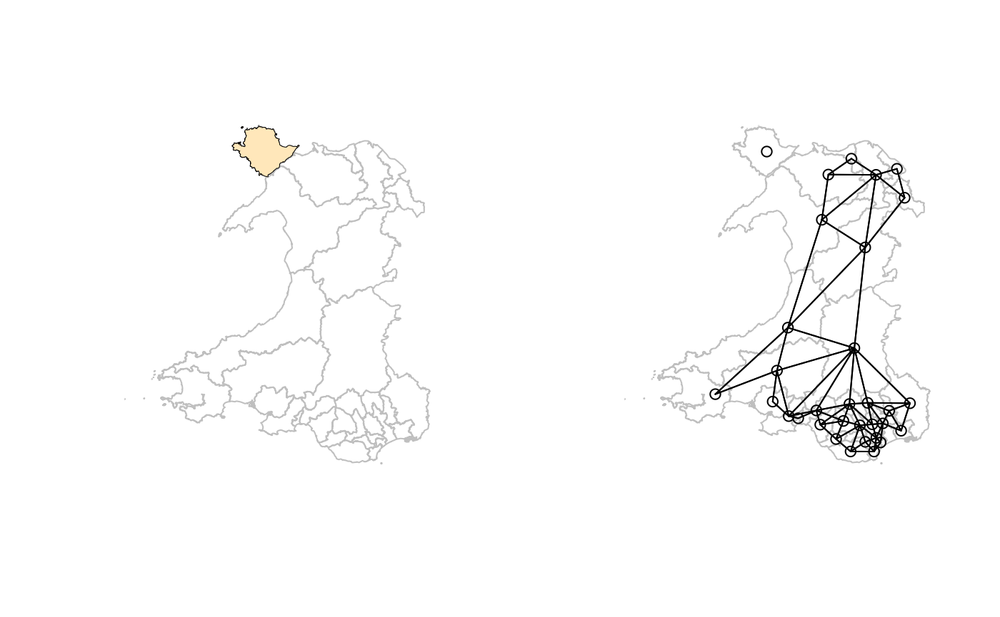
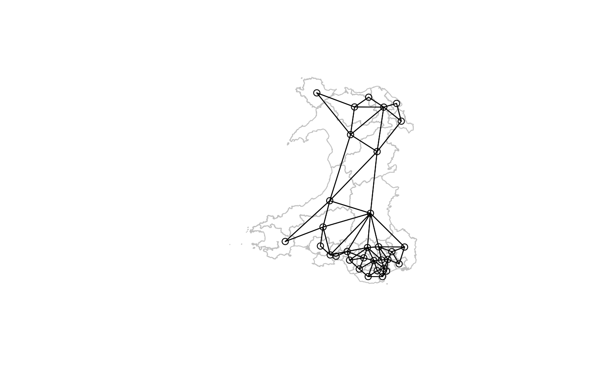
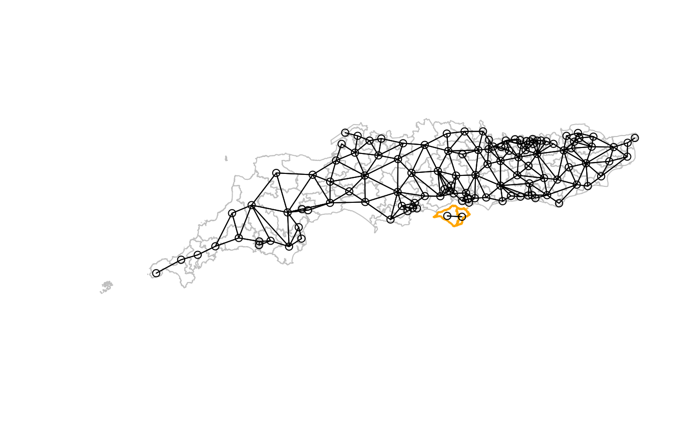
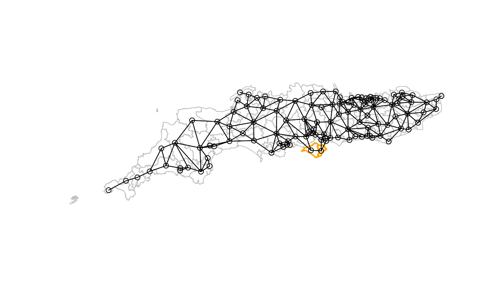

# No-neighbour observation and subgraph handling

## Introduction

The `spdep` package has always been careful about disconnected graphs,
especially where the disconnected observations are graph nodes with no
neighbours, that is no incoming or outgoing edges. In `nb` neighbour
objects, they are encoded as integer vectors of length 1 containing
integer `0`, which is an invalid index on \\\[1, N\]\\, where \\N\\ is
the observation count. Functions taking neighbour objects as arguments
use the `zero.policy` argument to guide how to handle no-neighbour
observations.

`spdep` has also had `n.comp.nb` to find the number of disjoint
connected subgraphs in an `nb` object, contributed by Nicholas Lewin-Koh
in 2001 and using depth-first search for symmetric neighbours, showing
in addition which observations belong to which subgraph. Obviously,
no-neighbour observations are singleton graph nodes, but subgraphs are
also troubling for spatial analysis, because there is no connection
between the spatial processes in those subgraphs. **The ripples in one
pond cannot cross into a separate pond if they are not connected**.

From `spdep` 1.3-1, steps began to raise awareness of the possibility
that neighbour objects might be created that are disconnected in some
way, mostly through warnings, and through the computation of subgraph
measures by default. This vignette is intended to provide some
background to these steps.

## No-neighbour observations

From the start, `nb` objects have recorded no-neighbour observations as
an integer vector of unit length and value `0`, where neighbours are
recorded as ID values between `1` and `N`, where `N` is the observation
count. `print` and `summary` methods have always reported the presence
of no-neighbour observations, and listed their IDs (or `region.id`
values). If an `nb` object contains no-neighbour observations, the user
has to decide whether to drop those observations, or if retained, what
value to give its weights. The `zero.policy` argument uses zero as the
value if TRUE, but if FALSE causes `nb2listw` to fail. The value of
`zero.policy` in a call to functions like `nb2listw`, `subset.listw` or
`mat2listw` creating `listw` objects representing sparse spatial weights
matrices is added to the created object as an attribute, and used
subsequently to pass through that choice to other functions. For
example, `moran.test` takes the value of this attribute as default for
its `zero.policy` argument:

``` r
library(spdep)
```

    ## Loading required package: spData

    ## Loading required package: sf

    ## Linking to GEOS 3.14.1, GDAL 3.12.1, PROJ 9.7.1; sf_use_s2() is TRUE

``` r
args(moran.test)
```

    ## function (x, listw, randomisation = TRUE, zero.policy = attr(listw, 
    ##     "zero.policy"), alternative = "greater", rank = FALSE, na.action = na.fail, 
    ##     spChk = NULL, adjust.n = TRUE, drop.EI2 = FALSE) 
    ## NULL

If observation \\i\\ has no neighbours, its weights sum \\\sum\_{j=1}^N
w\_{ij} = 0\\, as \\w\_{ij} = 0, \forall j\\ (see discussion in Bivand
and Portnov (2004)). Its eigenvalue will also be zero, with consequences
for analytical inference:

``` r
eigen(0)$values
```

    ## [1] 0

The `adjust.n` argument to measures of spatial autocorrelation is by
default TRUE, and subtracts the count of singleton nodes from \\N\\ in
an attempt to acknowledge the reduction in information available.

This discussion will address problems arising when analysing
areal/lattice data, and neighbours are defined as polygon features with
contiguous boundaries. One way in which no-neighbour observations may
occur is when they are islands. This is clearly the case in
Freni-Sterrantino, Ventrucci, and Rue (2018), where Capraia and Giglio
Isles are singleton nodes. Here we take Westminster constituencies for
Wales used in the July 2024 UK general election. If GDAL is at least
version 3.7.0, the driver supports compressed GeoPackage files, if not
they must be decompressed first.

``` r
GDAL37 <- numeric_version(unname(sf::sf_extSoftVersion()["GDAL"]), strict=FALSE)
(GDAL37 <- ifelse(is.na(GDAL37), FALSE, GDAL37 >= "3.7.0"))
```

    ## [1] TRUE

The boundaries are taken from the Ordnance Survey Boundary-Line site,
<https://osdatahub.os.uk/downloads/open/BoundaryLine>, choosing the 2024
Westminster constituencies, simplified using a tolerance of 50m to
reduce object size, and merged with selected voting outcomes for
constituencies in Great Britain
<https://electionresults.parliament.uk/countries/1>,
(<https://www.nationalarchives.gov.uk/doc/open-government-licence/version/3/>).
Here, the subset for Wales is useful as we will see:

``` r
file <- "etc/shapes/GB_2024_Wales_50m.gpkg.zip"
zipfile <- system.file(file, package="spdep")
if (GDAL37) {
    w50m <- st_read(zipfile)
} else {
    td <- tempdir()
    bn <- sub(".zip", "", basename(file), fixed=TRUE)
    target <- unzip(zipfile, files=bn, exdir=td)
    w50m <- st_read(target)
}
```

    ## Reading layer `GB_2024_Wales_50m' from data source 
    ##   `/tmp/RtmpEjBomy/temp_libpath486f623f1b6ee/spdep/etc/shapes/GB_2024_Wales_50m.gpkg.zip' 
    ##   using driver `GPKG'
    ## Simple feature collection with 32 features and 19 fields
    ## Geometry type: MULTIPOLYGON
    ## Dimension:     XY
    ## Bounding box:  xmin: 146597.1 ymin: 164536.5 xmax: 355287 ymax: 395993.5
    ## Projected CRS: OSGB36 / British National Grid

``` r
(nb_W_50m <- poly2nb(w50m, row.names=as.character(w50m$Constituency)))
```

    ## Warning in poly2nb(w50m, row.names = as.character(w50m$Constituency)): some observations have no neighbours;
    ## if this seems unexpected, try increasing the snap argument.

    ## Warning in poly2nb(w50m, row.names = as.character(w50m$Constituency)): neighbour object has 2 sub-graphs;
    ## if this sub-graph count seems unexpected, try increasing the snap argument.

    ## Neighbour list object:
    ## Number of regions: 32 
    ## Number of nonzero links: 136 
    ## Percentage nonzero weights: 13.28125 
    ## Average number of links: 4.25 
    ## 1 region with no links:
    ## Ynys Môn
    ## 2 disjoint connected subgraphs

The two subgraphs are the singleton Ynys Môn and all the other 31
constituencies:

``` r
table(table(attr(nb_W_50m, "ncomp")$comp.id))
```

    ## 
    ##  1 31 
    ##  1  1

The left map shows that Ynys Môn can be shown selecting by name, as a
black border, and by the zero cardinality of its neighbour set, using
`card`, filling the polygon. The right map shows the location of the
island, known in English as Anglesey, north-west of the Welsh mainland,
and with no neighbour links:

``` r
ynys_mon <- w50m$Constituency == "Ynys Môn"
pts <- st_point_on_surface(st_geometry(w50m))
opar <- par(mfrow=c(1, 2))
plot(st_geometry(w50m), border="grey75")
plot(st_geometry(w50m)[ynys_mon], add=TRUE)
plot(st_geometry(w50m)[card(nb_W_50m) == 0L], add=TRUE, border="transparent", col="wheat1")
plot(st_geometry(w50m), border="grey75")
plot(nb_W_50m, pts, add=TRUE)
```



``` r
par(opar)
```

From the maps, we can see that the island is close to two constituencies
across the Afon Menai (Menai Strait in English), the three simplified
polygons being less than 280m apart, measured between polygon
boundaries:

``` r
dym <- c(st_distance(w50m[ynys_mon,], w50m))
sort(dym)[1:12]
```

    ## Units: [m]
    ##  [1]      0.0000    123.4132    277.5414  16658.7265  37985.7086  54096.7729
    ##  [7]  58146.4320  65550.2491  67696.3323  93741.9873 113007.3659 137858.1826

Using a `snap` distance of 280m, we can join the island to its two
obvious proximate neighbours:

``` r
(nb_W_50m_snap <- poly2nb(w50m, row.names=as.character(w50m$Constituency), snap=280))
```

    ## Neighbour list object:
    ## Number of regions: 32 
    ## Number of nonzero links: 140 
    ## Percentage nonzero weights: 13.67188 
    ## Average number of links: 4.375

``` r
plot(st_geometry(w50m), border="grey75")
plot(nb_W_50m_snap, pts, add=TRUE)
```



In this case, increasing `snap` from its default of 10mm (or close
equivalents for geometries with known metrics; previously
`sqrt(.Machine$double.eps)` 1.4901161^{-8} in all cases) helps. The
symmetric links added are to:

``` r
attr(nb_W_50m_snap, "region.id")[nb_W_50m_snap[[which(ynys_mon)]]]
```

    ## [1] "Bangor Aberconwy"   "Dwyfor Meirionnydd"

This is not always going to be the case, but here the strait is narrow.
If islands are much further offshore, other steps may be required,
because a large `snap` distance will draw in extra neighbours for
already connected observations. It is also possible that increasing the
`snap` distance may fail to link islands if they are not considered
candidate neighbours, that is if their extents (bounding boxes),
buffered out by the `snap` value, do not intersect.

We can also use the distances to pick out those neighbour candidates
that meet our criterion of 280m, taking care not to lose the ordering
needed to identify the correct observations:

``` r
(meet_criterion <- sum(dym <= units::set_units(280, "m")))
```

    ## [1] 3

These candidates are the island itself, and the two neighbours across
the Menai Strait:

``` r
(cands <- attr(nb_W_50m, "region.id")[order(dym)[1:meet_criterion]])
```

    ## [1] "Ynys Môn"           "Bangor Aberconwy"   "Dwyfor Meirionnydd"

The `addlinks1` function can be used to add both the links from Ynys Môn
to its neighbours, and by symmetry from them to Ynys Môn. This approach
means that each island should be treated separately (or scripted in
sequence), but does not risk adding spurious neighbours in denser parts
of the study area.

``` r
(nb_W_50m_add <- addlinks1(nb_W_50m, from = cands[1], to = cands[2:meet_criterion]))
```

    ## Neighbour list object:
    ## Number of regions: 32 
    ## Number of nonzero links: 140 
    ## Percentage nonzero weights: 13.67188 
    ## Average number of links: 4.375

``` r
all.equal(nb_W_50m_add, nb_W_50m_snap, check.attributes=FALSE)
```

    ## [1] TRUE

Since these constituency observations have areal support, it is not
surprising that changing support to points and using \\k\\-nearest
neighbours does not work adequately, because the distance measurements
are between the points representing the polygons rather than as above
between the areal unit boundaries:

``` r
k2 <- knn2nb(knearneigh(pts, k=2), row.names=as.character(w50m$Constituency), sym=TRUE)
```

    ## Warning in knn2nb(knearneigh(pts, k = 2), row.names =
    ## as.character(w50m$Constituency), : neighbour object has 2 sub-graphs

``` r
attr(k2, "region.id")[k2[[which(ynys_mon)]]]
```

    ## [1] "Bangor Aberconwy" "Clwyd North"

Here, Clwyd North, east of Bangor Aberconwy, is given as a neighbour of
Ynys Môn but Dwyfor Meirionnydd, west of Bangor Aberconwy, is not. In
addition, there are two subgraphs, which still remain up to \\k=6\\.

## Subgraphs

Subgraphs may be found when no-neighbour observations are present, but
also when the graph is split between two blocks of observations with no
path from any observation in a block to any in another block, across the
low population density constituencies in mid-Wales:

``` r
(k6 <- knn2nb(knearneigh(pts, k=6), row.names=as.character(w50m$Constituency), sym=TRUE))
```

    ## Warning in knn2nb(knearneigh(pts, k = 6), row.names =
    ## as.character(w50m$Constituency), : neighbour object has 2 sub-graphs

    ## Neighbour list object:
    ## Number of regions: 32 
    ## Number of nonzero links: 238 
    ## Percentage nonzero weights: 23.24219 
    ## Average number of links: 7.4375 
    ## 2 disjoint connected subgraphs

``` r
plot(st_geometry(w50m), border="grey75")
plot(k6, pts, add=TRUE)
```

 We can show the
block structure by displaying the binary spatial weights matrix:

``` r
o <- order(attr(k6, "ncomp")$comp.id)
image(t(nb2mat(k6, style="B")[o, rev(o)]), axes=FALSE, asp=1)
```


This occurs frequently with point support, but may also occur with areal
support, as Freni-Sterrantino, Ventrucci, and Rue (2018) find for the
eight municipalities on the island of Elba.

From `spdep` 1.3-6, if the `igraph` and `spatialreg` packages are
available, `n.comp.nb` uses
[`igraph::components`](https://r.igraph.org/reference/components.html)
to compute the graph components, also using depth-first search. The
original implementation is as fast, but for directed (asymmetric) graphs
converts first to symmetry, while
[`igraph::components`](https://r.igraph.org/reference/components.html)
can handle directed graphs without such conversion (see
<https://github.com/r-spatial/spdep/issues/160> for details).

``` r
(k6a <- knn2nb(knearneigh(pts, k=6), row.names=as.character(w50m$Constituency)))
```

    ## Warning in knn2nb(knearneigh(pts, k = 6), row.names =
    ## as.character(w50m$Constituency)): neighbour object has 2 sub-graphs

    ## Neighbour list object:
    ## Number of regions: 32 
    ## Number of nonzero links: 192 
    ## Percentage nonzero weights: 18.75 
    ## Average number of links: 6 
    ## 2 disjoint connected subgraphs
    ## Non-symmetric neighbours list

Another case demonstrates how cyclical subgraphs may appear; this is
again taken from constituencies in the 2024 UK general election,
subsetted to those in England south of London.

``` r
file <- "etc/shapes/GB_2024_southcoast_50m.gpkg.zip"
zipfile <- system.file(file, package="spdep")
if (GDAL37) {
    sc50m <- st_read(zipfile)
} else {
    td <- tempdir()
    bn <- sub(".zip", "", basename(file), fixed=TRUE)
    target <- unzip(zipfile, files=bn, exdir=td)
    sc50m <- st_read(target)
}
```

    ## Reading layer `GB_2024_southcoast_50m' from data source 
    ##   `/tmp/RtmpEjBomy/temp_libpath486f623f1b6ee/spdep/etc/shapes/GB_2024_southcoast_50m.gpkg.zip' 
    ##   using driver `GPKG'
    ## Simple feature collection with 119 features and 19 fields
    ## Geometry type: MULTIPOLYGON
    ## Dimension:     XY
    ## Bounding box:  xmin: 82643.12 ymin: 5342.9 xmax: 640301.6 ymax: 187226.2
    ## Projected CRS: OSGB36 / British National Grid

``` r
(nb_sc_50m <- poly2nb(sc50m, row.names=as.character(sc50m$Constituency)))
```

    ## Warning in poly2nb(sc50m, row.names = as.character(sc50m$Constituency)): neighbour object has 2 sub-graphs;
    ## if this sub-graph count seems unexpected, try increasing the snap argument.

    ## Neighbour list object:
    ## Number of regions: 119 
    ## Number of nonzero links: 530 
    ## Percentage nonzero weights: 3.742674 
    ## Average number of links: 4.453782 
    ## 2 disjoint connected subgraphs

The second subgraph only has two members, who are each others’ only
neighbours, known as a cyclical component.

``` r
nc <- attr(nb_sc_50m, "ncomp")$comp.id
table(nc)
```

    ## nc
    ##   1   2 
    ## 117   2

Both constituencies are on the Isle of Wight:

``` r
(sub2 <- attr(nb_sc_50m, "region.id")[nc == 2L])
```

    ## [1] "Isle of Wight East" "Isle of Wight West"

``` r
pts <- st_point_on_surface(st_geometry(sc50m))
plot(st_geometry(sc50m), border="grey75")
plot(st_geometry(sc50m)[nc == 2L], border="orange", lwd=2, add=TRUE)
plot(nb_sc_50m, pts, add=TRUE)
```



This has consequences for the eigenvalues of the spatial weights matrix,
pointed out by Smirnov and Anselin (2009) and Bivand, Hauke, and
Kossowski (2013). With row-standardised weights, the eigenvalues of this
component are:

``` r
1/range(eigen(cbind(c(0, 1), c(1, 0)))$values)
```

    ## [1] -1  1

``` r
1/range(eigen(nb2mat(subset(nb_sc_50m, nc == 2L), style="W"))$values)
```

    ## [1] -1  1

This “takes over” the lower domain boundary, which for the whole data
set is now the same:

``` r
1/range(eigen(nb2mat(nb_sc_50m, style="W"))$values)
```

    ## [1] -1  1

compared to the lower domain boundary for the remainder of the study
area:

``` r
1/range(eigen(nb2mat(subset(nb_sc_50m, nc == 1L), style="W"))$values)
```

    ## [1] -1.094637  1.000000

This subgraph may be added to the remainder as shown above:

``` r
iowe <- match(sub2[1], attr(nb_sc_50m, "region.id"))
diowe <- c(st_distance(sc50m[iowe,], sc50m))
sort(diowe)[1:12]
```

    ## Units: [m]
    ##  [1]     0.000     0.000  1886.833  3509.366  6693.575  6943.672  7678.999
    ##  [8]  8576.454 10579.530 12163.332 16875.920 17161.786

``` r
ioww <- match(sub2[2], attr(nb_sc_50m, "region.id"))
dioww <- c(st_distance(sc50m[ioww,], sc50m))
sort(dioww)[1:12]
```

    ## Units: [m]
    ##  [1]     0.000     0.000  1232.724  2541.318  5746.764  5770.602  8902.579
    ##  [8]  9747.265 10529.540 10909.845 12250.564 12379.871

Using 5km as a cutoff seems prudent, but would not work as a `snap`
value. Taking Isle of Wight East first, there are four constituencies
with boundaries within 5km:

``` r
(meet_criterion <- sum(diowe <= units::set_units(5000, "m")))
```

    ## [1] 4

Obviously the contiguous neighbour is among them with zero distance, and
needs to be dropped, although `addlinks1` would drop the duplicate:

``` r
(cands <- attr(nb_sc_50m, "region.id")[order(diowe)[1:meet_criterion]])
```

    ## [1] "Isle of Wight East" "Isle of Wight West" "Portsmouth South"  
    ## [4] "Gosport"

``` r
(nb_sc_50m_iowe <- addlinks1(nb_sc_50m, from = cands[1], to = cands[3:meet_criterion]))
```

    ## Neighbour list object:
    ## Number of regions: 119 
    ## Number of nonzero links: 534 
    ## Percentage nonzero weights: 3.77092 
    ## Average number of links: 4.487395

Although all constituencies are now linked, we should see whether using
the 5km criterion brings in extra neighbours for Isle of Wight West:

``` r
(meet_criterion <- sum(dioww <= units::set_units(5000, "m")))
```

    ## [1] 4

It, does, but we need to beware of the sorting order of the zero
self-distance and contiguous neighbour distance, where `from` is now in
the second position:

``` r
(cands <- attr(nb_sc_50m, "region.id")[order(dioww)[1:meet_criterion]])
```

    ## [1] "Isle of Wight East" "Isle of Wight West" "New Forest West"   
    ## [4] "New Forest East"

This then yields links to the north-west:

``` r
(nb_sc_50m_iow <- addlinks1(nb_sc_50m_iowe, from = cands[2], to = cands[3:meet_criterion]))
```

    ## Neighbour list object:
    ## Number of regions: 119 
    ## Number of nonzero links: 538 
    ## Percentage nonzero weights: 3.799167 
    ## Average number of links: 4.521008

``` r
pts <- st_point_on_surface(st_geometry(sc50m))
plot(st_geometry(sc50m), border="grey75")
plot(st_geometry(sc50m)[nc == 2L], border="orange", lwd=2, add=TRUE)
plot(nb_sc_50m_iow, pts, add=TRUE)
```



It remains to add a suitable generalisation of `addlinks1` to handle a
`from` vector argument and a `to` argument taking a list of vectors.

## Per-session control of function behaviour

From very early on, the default value of the `zero.policy` argument to
many methods and functions was `NULL`. If the value was `NULL`,
`zero.policy` would be set from `get.ZeroPolicyOption`:

``` r
get.ZeroPolicyOption()
```

    ## [1] FALSE

On loading `spdep`, the internal option is set to `FALSE`, so functions
and methods using `zero.policy` need to choose how to handle islands:

``` r
try(nb2listw(nb_W_50m))
```

    ## Error in nb2listw(nb_W_50m) : 
    ##   Empty neighbour sets found (zero.policy: FALSE)

In this case, it was shown above how the island may reasonably be
associated with proximate constituencies on the mainland. If, however,
the user wishes to override the default, `set.ZeroPolicyOption` may be
used to set a different per-session default:

``` r
set.ZeroPolicyOption(TRUE)
```

``` r
get.ZeroPolicyOption()
```

    ## [1] TRUE

``` r
(lw <- nb2listw(nb_W_50m))
```

    ## Characteristics of weights list object:
    ## Neighbour list object:
    ## Number of regions: 32 
    ## Number of nonzero links: 136 
    ## Percentage nonzero weights: 13.28125 
    ## Average number of links: 4.25 
    ## 1 region with no links:
    ## Ynys Môn
    ## 2 disjoint connected subgraphs
    ## 
    ## Weights style: W 
    ## Weights constants summary:
    ##    n  nn S0       S1      S2
    ## W 31 961 31 15.36355 129.051

``` r
attr(lw, "zero.policy")
```

    ## [1] TRUE

``` r
set.ZeroPolicyOption(FALSE)
```

When a `listw` object is created with `zero.policy` set to `TRUE`, this
choice is added to the output object as an attribute and applied when
the object is used (unless specifically overridden). Note also above
that while there are 32 constituencies, the observation count reported
by `spweights.constants` called by the `print` method for `listw` object
has argument `adjust.n` TRUE, dropping no-neighbour observations from
the observation count.

Other internal options have been introduced to suppress no-neighbour and
subgraph warnings when creating `nb` objects. The default values are as
follows:

``` r
get.NoNeighbourOption()
```

    ## [1] TRUE

``` r
get.SubgraphOption()
```

    ## [1] TRUE

``` r
get.SubgraphCeiling()
```

    ## [1] 100000

`get.NoNeighbourOption` controls the issuing of warnings when `nb`
objects are created with no-neighbour observations; `get.SubgraphOption`
works similarly but for warnings issued when there is more than one
graph component; both are TRUE by default. `get.SubgraphCeiling` sets
the integer value of graph nodes plus graph edges above which
calculating on the graph is considered too costly in compute time, the
default is 100,000. This corresponds to a dense neighbour set with just
over 300 nodes (with almost 100000 edges) such as that needed to use
inverse distance weights, or just over 14,000 nodes with an average
neighbour count of 6.

The `print` method for `nb` objects reports no-neighbour and subgraph
status anyway, so careful users who always examine generated objects may
prefer to supress the warnings, but warnings seem prudent when users may
not examine the objects, or when generation is by subsetting of larger
objects, for example in the creation of training and test data sets.
Here the Welsh constituency boundaries will be used to show the
behaviour of the internal options:

``` r
set.NoNeighbourOption(FALSE)
(nb_W_50mz <- poly2nb(w50m, row.names=as.character(w50m$Constituency)))
```

    ## Warning in poly2nb(w50m, row.names = as.character(w50m$Constituency)): neighbour object has 2 sub-graphs;
    ## if this sub-graph count seems unexpected, try increasing the snap argument.

    ## Neighbour list object:
    ## Number of regions: 32 
    ## Number of nonzero links: 136 
    ## Percentage nonzero weights: 13.28125 
    ## Average number of links: 4.25 
    ## 1 region with no links:
    ## Ynys Môn
    ## 2 disjoint connected subgraphs

Turning both off removes the warnings:

``` r
set.SubgraphOption(FALSE)
(nb_W_50my <- poly2nb(w50m, row.names=as.character(w50m$Constituency)))
```

    ## Neighbour list object:
    ## Number of regions: 32 
    ## Number of nonzero links: 136 
    ## Percentage nonzero weights: 13.28125 
    ## Average number of links: 4.25 
    ## 1 region with no links:
    ## Ynys Môn

When `get.SubgraphOption` is FALSE, the attribute containing the output
of `n.comp.nb` is not added:

``` r
str(attr(nb_W_50my, "ncomp"))
```

    ##  NULL

The reduction of the ceiling to below node count 32 plus edge count 136
also supresses the calculation of graph components:

``` r
set.SubgraphOption(TRUE)
set.SubgraphCeiling(100L)
(nb_W_50mx <- poly2nb(w50m, row.names=as.character(w50m$Constituency)))
```

    ## Neighbour list object:
    ## Number of regions: 32 
    ## Number of nonzero links: 136 
    ## Percentage nonzero weights: 13.28125 
    ## Average number of links: 4.25 
    ## 1 region with no links:
    ## Ynys Môn

``` r
str(attr(nb_W_50mx, "ncomp"))
```

    ##  NULL

Restoring the remaining default values:

``` r
set.SubgraphCeiling(100000L)
set.NoNeighbourOption(TRUE)
```

## Unintentional disconnected graphs

Sometimes apparently sensible polygons turn out to be represented in
such a way that disconnected graphs are generated when extracting
contiguities. One such case was raised in
<https://github.com/r-spatial/spdep/issues/162>, for subdivisions of
Tokyo. The original data file `tokyomet262.*` from
<https://sgsup.asu.edu/sites/g/files/litvpz426/files/SparcFiles/tokyo_0.zip>
was created some twenty years ago by Tomoki Nakaya and Martin Charlton,
and some geometry issues were known at the time. A possibility that may
affect legacy files is projection of geometries on 32-bit platforms, but
it is not known whether this affected this file. Here it has been
re-packaged as a compressed GeoPackage:

``` r
file <- "etc/shapes/tokyo.gpkg.zip"
zipfile <- system.file(file, package="spdep")
if (GDAL37) {
    tokyo <- st_read(zipfile)
} else {
    td <- tempdir()
    bn <- sub(".zip", "", basename(file), fixed=TRUE)
    target <- unzip(zipfile, files=bn, exdir=td)
    tokyo <- st_read(target)
}
```

    ## Reading layer `tokyo' from data source 
    ##   `/tmp/RtmpEjBomy/temp_libpath486f623f1b6ee/spdep/etc/shapes/tokyo.gpkg.zip' 
    ##   using driver `GPKG'
    ## Simple feature collection with 262 features and 3 fields
    ## Geometry type: MULTIPOLYGON
    ## Dimension:     XY
    ## Bounding box:  xmin: 266206.6 ymin: -90932.11 xmax: 411400.3 ymax: 37142.75
    ## Projected CRS: Tokyo / Japan Plane Rectangular CS VI

After correcting invalid polygons:

``` r
all(st_is_valid(tokyo))
```

    ## [1] TRUE

``` r
tokyo <- st_make_valid(tokyo)
```

applying `poly2nb` with the legacy default snap value produced numerous
singleton observations as well as many multiple-observation subgraphs:

``` r
(nb_t0 <- poly2nb(tokyo, snap=sqrt(.Machine$double.eps)))
```

    ## Warning in poly2nb(tokyo, snap = sqrt(.Machine$double.eps)): some observations have no neighbours;
    ## if this seems unexpected, try increasing the snap argument.

    ## Warning in poly2nb(tokyo, snap = sqrt(.Machine$double.eps)): neighbour object has 23 sub-graphs;
    ## if this sub-graph count seems unexpected, try increasing the snap argument.

    ## Neighbour list object:
    ## Number of regions: 262 
    ## Number of nonzero links: 946 
    ## Percentage nonzero weights: 1.378125 
    ## Average number of links: 3.610687 
    ## 10 regions with no links:
    ## 101, 127, 134, 135, 152, 154, 167, 237, 242, 243
    ## 23 disjoint connected subgraphs

The legacy default `snap` value when the coordinates are measured in
metres was 15 nanometres, which effectively assumed that the coordinates
making up polygon boundaries were identical:

``` r
units::set_units(units::set_units(attr(nb_t0, "snap"), "m"), "nm")
```

    ## 14.90116 [nm]

Stepping out a little to 2mm, the lack of contact ceased to be a
problem.

``` r
(nb_t1 <- poly2nb(tokyo, snap=0.002))
```

    ## Neighbour list object:
    ## Number of regions: 262 
    ## Number of nonzero links: 1390 
    ## Percentage nonzero weights: 2.02494 
    ## Average number of links: 5.305344

``` r
units::set_units(units::set_units(attr(nb_t1, "snap"), "m"), "mm")
```

    ## 2 [mm]

On that basis, the default was changed from `spdep` 1.3-6 to 10mm for
projected polygons, and the snap value used was returned as an attribute
of the neighbour object:

``` r
(nb_t2 <- poly2nb(tokyo))
```

    ## Neighbour list object:
    ## Number of regions: 262 
    ## Number of nonzero links: 1390 
    ## Percentage nonzero weights: 2.02494 
    ## Average number of links: 5.305344

``` r
units::set_units(units::set_units(attr(nb_t2, "snap"), "m"), "mm")
```

    ## 10 [mm]

Where the polygons are represented by geographical (spherical)
coordinates, the new default from `spdep` 1.3-6 is set to a value
mimicking 10mm:

``` r
(nb_t3 <- poly2nb(st_transform(tokyo, "OGC:CRS84")))
```

    ## Neighbour list object:
    ## Number of regions: 262 
    ## Number of nonzero links: 1336 
    ## Percentage nonzero weights: 1.946274 
    ## Average number of links: 5.099237

The default `snap` value used in `poly2nb` when the polygons are
expressed in decimal degrees is:

``` r
attr(nb_t3, "snap")
```

    ## [1] 9e-08

This was set based on the apparent “size” of 10mm in decimal degrees:

``` r
(180 * 0.01) / (pi * 6378137)
```

    ## [1] 8.983153e-08

## References

Bivand, Roger, Jan Hauke, and Tomasz Kossowski. 2013. “Computing the
Jacobian in Gaussian Spatial Autoregressive Models: An Illustrated
Comparison of Available Methods.” *Geographical Analysis* 45 (2):
150–79. <https://doi.org/10.1111/gean.12008>.

Bivand, Roger, and B. A. Portnov. 2004. “Exploring Spatial Data Analysis
Techniques Using R: The Case of Observations with No Neighbours.” In
*Advances in Spatial Econometrics: Methodology, Tools, Applications*,
edited by Luc Anselin, Raymond J. G. M. Florax, and S. J. Rey, 121–42.
Berlin: Springer. <https://doi.org/10.1007/978-3-662-05617-2_6>.

Freni-Sterrantino, Anna, Massimo Ventrucci, and Håvard Rue. 2018. “A
Note on Intrinsic Conditional Autoregressive Models for Disconnected
Graphs.” *Spatial and Spatio-Temporal Epidemiology* 26: 25–34.
<https://doi.org/10.1016/j.sste.2018.04.002>.

Smirnov, O., and L. Anselin. 2009. “An O(N) Parallel Method of Computing
the Log-Jacobian of the Variable Transformation for Models with Spatial
Interaction on a Lattice.” *Computational Statistics & Data Analysis* 53
(8): 2980–88. <https://doi.org/10.1016/j.csda.2008.10.010>.
